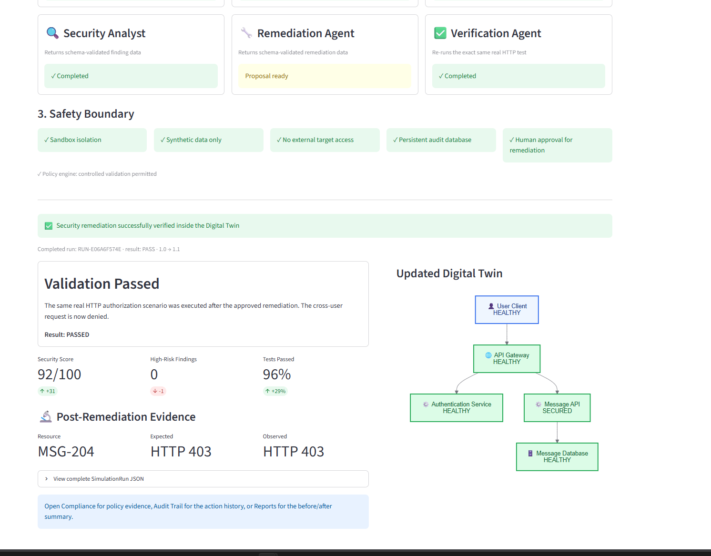
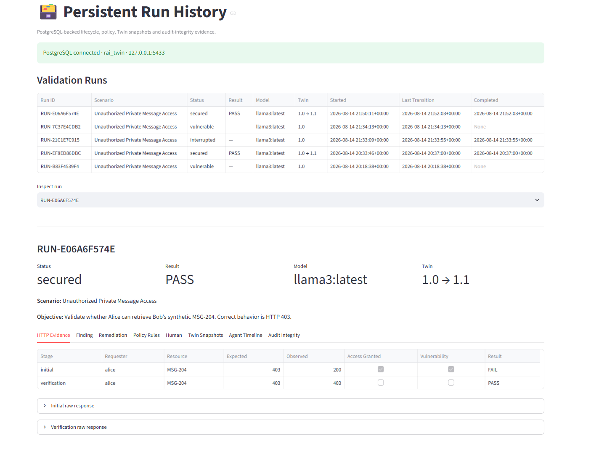

# Responsible AI Digital Twin Platform

A **Digital-Twin-Driven Responsible AI Platform** for controlled AI-agent validation, security testing, human-governed remediation, persistent evidence, policy enforcement, and auditable before/after verification.

> **Status:** Research prototype / proof of concept.  
> **Safety boundary:** The current security scenarios run only against a local Docker sandbox with synthetic users and synthetic data. The project is not designed to attack or test external systems.



## Overview

The platform creates a stateful Digital Twin of a synthetic messaging application (`SecureMessenger`) and coordinates multiple AI/software agents to execute a controlled security-validation lifecycle:

1. Define a safe validation scenario.
2. Evaluate platform policy before execution.
3. Run a real HTTP test against the local Docker sandbox.
4. Observe the returned evidence.
5. Ask a local Ollama LLM for a schema-validated security assessment.
6. Generate a structured defensive remediation proposal.
7. Evaluate the remediation through the policy engine.
8. Require explicit human approval before changing the sandbox.
9. Apply only the approved local sandbox remediation.
10. Re-run the exact same real HTTP validation.
11. Persist findings, policies, approvals, HTTP evidence, Digital Twin snapshots, and audit events in PostgreSQL.
12. Reconstruct historical runs and reports after Streamlit restarts.

The first implemented scenario demonstrates **Broken Object-Level Authorization (BOLA)**:

```text
Alice requests Bob's synthetic MSG-204
              |
              v
Initial expected HTTP 403
Initial observed HTTP 200  -> vulnerability detected
              |
              v
Structured Security Analyst assessment
              |
              v
Structured remediation proposal
              |
              v
PERMIT_WITH_APPROVAL
              |
              v
Explicit human approval
              |
              v
Secure authorization mode applied to local sandbox
              |
              v
Same request re-executed
              |
              v
Expected HTTP 403
Observed HTTP 403 -> PASS
```

## Demonstrated Capabilities

- Streamlit multi-page user interface
- Stateful Digital Twin model
- Local Docker sandbox
- Synthetic vulnerable messaging mini-application
- Real HTTP validation and verification
- Local Ollama LLM integration
- Schema-validated Pydantic LLM outputs
- Deterministic structured fallback if Ollama is unavailable/slow
- Agent-based workflow:
  - Scenario Planner
  - Security Testing Agent
  - Observer Agent
  - Security Analyst
  - Remediation Agent
  - Verification Agent
- Explicit human remediation approval
- Policy outcomes:
  - `PERMIT`
  - `PERMIT_WITH_APPROVAL`
  - `BLOCK`
- Persistent PostgreSQL evidence store
- Alembic schema migrations
- Explicit run lifecycle and interrupted/aborted runs
- Persistent policy rule registry
- Rule-level policy evaluation evidence
- Digital Twin state snapshots
- SHA-256 audit-event hash chains
- Persistent Run History
- Database-backed reports and JSON evidence bundles

## Current Architecture

```text
Browser
  |
  v
Streamlit UI
  |
  v
Orchestration Service
  |
  +------------------+-------------------+------------------+
  |                  |                   |                  |
  v                  v                   v                  v
Agents          Policy Engine      Evidence Engine     Digital Twin
  |                  |                   |                  |
  |                  |                   |                  |
  +------------------+-------------------+------------------+
                         |
                         v
                     PostgreSQL
                         |
                         v
                       Alembic

Local runtime services:
  - Ollama / llama3
  - Docker SecureMessenger
```

## Platform Pages

### Overview

Displays the current Digital Twin, platform health, Ollama availability, PostgreSQL evidence-store status, and security metrics.

### Digital Twin

Shows the current Twin state, version, topology, component states, sandbox isolation controls, and SecureMessenger runtime status.

### Security Scenario Lab

Executes the controlled validation lifecycle and displays:

- AI runtime
- Docker sandbox runtime
- selected scenario and objective
- agent status
- safety boundary
- real HTTP evidence
- structured finding
- structured remediation
- policy decision
- human approval gate
- verification result
- updated Digital Twin

### Agent Activity

Shows the actions and status transitions of the platform agents.

### Run History

Loads persistent historical runs from PostgreSQL and exposes:

- HTTP Evidence
- Finding
- Remediation
- Policy Rules
- Human decision
- Twin Snapshots
- Agent Timeline
- Audit Integrity



### Compliance & Governance

Displays the technical governance controls and persistent policy-rule registry.

Current policy rules include:

| Rule ID | Purpose |
|---|---|
| `POL-SBX-001` | Sandbox-only execution |
| `POL-DATA-001` | Synthetic data only |
| `POL-NET-001` | External targets prohibited |
| `POL-DB-001` | Persistent evidence store required |
| `POL-HUM-001` | Human approval required for remediation |
| `POL-AUD-001` | Privileged actions must be auditable |
| `POL-VER-001` | Remediation requires verification |

This page demonstrates technical controls. It **does not claim legal compliance with the EU AI Act, GDPR, or other regulations**.

### Audit Trail

Displays PostgreSQL-backed audit events and verifies the per-run SHA-256 evidence hash chain.

### Reports

Reconstructs historical run evidence directly from PostgreSQL and exports a JSON evidence bundle.

---

## Project Structure

```text
ResponsibleAI_DigitalTwin/
|
|-- alembic/
|   |-- env.py
|   `-- versions/
|       |-- 001_initial_schema.py
|       |-- 002_run_lifecycle.py
|       |-- 003_evidence_integrity.py
|       |-- 004_policy_registry.py
|       `-- 005_twin_snapshots.py
|
|-- models/
|   |-- database_models.py
|   |-- policy_models.py
|   |-- twin_models.py
|   `-- workflow_models.py
|
|-- pages/
|   |-- overview.py
|   |-- digital_twin.py
|   |-- scenario_lab.py
|   |-- agents.py
|   |-- run_history.py
|   |-- compliance.py
|   |-- audit.py
|   `-- reports.py
|
|-- sandbox/
|   `-- secure_messenger/
|       |-- app.py
|       |-- database.py
|       |-- models.py
|       |-- Dockerfile
|       `-- requirements.txt
|
|-- scripts/
|   `-- migrate_database.py
|
|-- services/
|   |-- agent_service.py
|   |-- audit_service.py
|   |-- database_service.py
|   |-- evidence_service.py
|   |-- ollama_service.py
|   |-- orchestration_service.py
|   |-- policy_registry_service.py
|   |-- policy_service.py
|   |-- repository_service.py
|   |-- run_service.py
|   |-- sandbox_service.py
|   |-- security_test_service.py
|   `-- twin_service.py
|
|-- app.py
|-- main.py
|-- docker-compose.yml
|-- alembic.ini
|-- requirements.txt
|-- .env.example
|-- .gitignore
`-- README.md
```

## Prerequisites

Recommended development environment:

- Python 3.12+
- Docker Desktop
- Docker Compose
- WSL2 on Windows, or a Linux/macOS Docker environment
- Ollama
- Git
- A local Ollama model such as `llama3:latest`

The current development workflow was tested with Windows + PyCharm + WSL2 + Docker Desktop.

## 1. Clone the Repository

```bash
git clone https://github.com/vikashmaheshwari97/ResponsibleAI_DigitalTwin.git
cd ResponsibleAI_DigitalTwin
```

## 2. Create the Python Environment

### Windows PowerShell

```powershell
python -m venv .venv
& ".\.venv\Scripts\Activate.ps1"
python -m pip install --upgrade pip
python -m pip install -r requirements.txt
```

### Linux/macOS

```bash
python -m venv .venv
source .venv/bin/activate
python -m pip install --upgrade pip
python -m pip install -r requirements.txt
```

## 3. Configure Local Environment Variables

Copy the example file:

### Windows PowerShell

```powershell
Copy-Item .env.example .env
```

### Linux/macOS

```bash
cp .env.example .env
```

Edit `.env` and replace the placeholder development credentials.

Example:

```dotenv
POSTGRES_DB=rai_twin
POSTGRES_USER=rai_user
POSTGRES_PASSWORD=<your-local-password>
RAI_DATABASE_URL=postgresql+psycopg://rai_user:<your-local-password>@127.0.0.1:5433/rai_twin
SANDBOX_ADMIN_TOKEN=<your-local-admin-token>
OLLAMA_HOST=http://127.0.0.1:11434
```

`.env` is excluded from Git and must never be committed.

For local PowerShell execution, load the important values into the process environment before starting Streamlit if your shell/tooling does not automatically load `.env`:

```powershell
$env:POSTGRES_DB="rai_twin"
$env:POSTGRES_USER="rai_user"
$env:POSTGRES_PASSWORD="<your-local-password>"
$env:RAI_DATABASE_URL="postgresql+psycopg://rai_user:<your-local-password>@127.0.0.1:5433/rai_twin"
$env:SANDBOX_ADMIN_TOKEN="<your-local-admin-token>"
$env:OLLAMA_HOST="http://127.0.0.1:11434"
```

## 4. Start Docker Services

From WSL/Linux/macOS:

```bash
docker compose up -d
docker compose ps
```

Expected services:

```text
rai-secure-messenger   Up
rai-postgres           Up (healthy)
```

Check SecureMessenger:

```bash
curl http://127.0.0.1:8001/health
```

A fresh/reset environment should report approximately:

```json
{
  "status": "healthy",
  "application": "SecureMessenger",
  "version": "1.0",
  "authorization_mode": "vulnerable"
}
```

## 5. Apply Database Migrations

From the activated Python environment:

```bash
python scripts/migrate_database.py
```

Verify:

```bash
python -m alembic current
```

Expected:

```text
005_twin_snapshots (head)
```

Migration history:

```bash
python -m alembic history
```

The migration chain is:

```text
001_initial_schema
    ->
002_run_lifecycle
    ->
003_evidence_integrity
    ->
004_policy_registry
    ->
005_twin_snapshots
```

## 6. Start Ollama

Make sure Ollama is installed and running.

```bash
ollama serve
```

In another terminal:

```bash
ollama list
```

The current PoC prefers a local model such as:

```text
llama3:latest
```

If the LLM call times out or is unavailable, the analyst/remediation stages can use deterministic schema-valid fallbacks so the controlled workflow does not remain permanently stuck.

## 7. Start Streamlit

```bash
python -m streamlit run app.py
```

Open:

```text
http://localhost:8501
```

## 8. Run the Demonstration

1. Click **Reset Demo**.
2. Open **AI Validation -> Security Scenario Lab**.
3. Confirm:
   - Ollama connected.
   - SecureMessenger `v1.0 / vulnerable`.
   - PostgreSQL connected.
4. Start **Unauthorized Private Message Access**.
5. Expected initial evidence:

```text
Requester: Alice
Resource: MSG-204
Expected: HTTP 403
Observed: HTTP 200
Result: FAIL
```

6. Review the structured Security Analyst finding.
7. Ask the Remediation Agent.
8. Expected policy state:

```text
PERMIT_WITH_APPROVAL
```

9. Approve and re-test.
10. Expected verification:

```text
Expected: HTTP 403
Observed: HTTP 403
Result: PASS
```

11. The Digital Twin should transition:

```text
1.0 -> 1.1
Message API: VULNERABLE -> SECURED
```

12. Open **Run History** and inspect the persistent evidence.

## Expected Successful Run

A successful run should show approximately:

```text
Status: secured
Result: PASS
Model: llama3:latest
Twin: 1.0 -> 1.1
```

Its evidence should include:

- initial HTTP test
- verification HTTP test
- structured finding
- remediation
- policy decisions
- rule-level policy results
- human approval
- agent timeline
- Digital Twin snapshots
- audit events
- evidence-integrity hashes

## Run Lifecycle

The persistent lifecycle includes:

```text
created
  ->
running
  ->
vulnerable
  ->
awaiting_approval
  ->
remediating
  ->
verifying
  ->
secured
```

Terminal alternatives include:

- `failed`
- `rejected`
- `interrupted`
- `aborted`

If a development process stops mid-run, use **Run History** to mark the run interrupted or aborted rather than leaving it ambiguous.

## Evidence Integrity

Audit events are chained with SHA-256 values:

```text
event 1 -> event 2 -> event 3 -> ...
```

Each event can store:

- `sequence_number`
- `previous_hash`
- `event_hash`
- `integrity_version`

Run History and Audit Trail can verify whether a chain is valid.

For older development runs created before hashing was enabled, use **Rebuild / Backfill Hash Chain**.

## PostgreSQL Evidence Model

The database currently contains the following core tables:

```text
simulation_runs
security_tests
findings
remediations
human_decisions
policy_decisions
agent_events
audit_events
policy_rules
policy_rule_results
twin_snapshots
alembic_version
```

## Safety Design

The PoC deliberately limits security validation to:

- local Docker services
- localhost targets
- synthetic identities
- synthetic messages
- predefined safe validation flows
- defensive remediation
- explicit human approval before security-changing actions
- post-remediation verification

Do not repurpose the demonstration against systems that you do not own or have explicit permission to test.

## Development Status

| Phase | Status |
|---|---:|
| Streamlit visual PoC | 100% |
| Professional Digital Twin UI | ~90% |
| Digital Twin data model | ~90% |
| Real LLM agents | ~95% |
| Agent orchestration | ~92% |
| Docker sandbox | 100% |
| Vulnerable messaging mini-app | 100% |
| Real controlled security tests | 100% |
| Policy/compliance engine | ~92% |
| PostgreSQL + persistent audit evidence | ~95% |
| UT server deployment | Not started |

## Roadmap

The next development milestones are:

1. **Multiple controlled safe scenarios**
   - invalid/expired synthetic authentication token
   - malformed synthetic input validation
   - local rate/abuse-control scenario

2. **Professional Run Analytics**
   - total/pass/fail/interrupted counts
   - verification rate
   - policy block rate
   - average run duration
   - human-approval statistics
   - per-scenario trends

3. **Enhanced Database-Backed Reports**
   - richer run summary
   - evidence timeline
   - Twin before/after views
   - policy and human-oversight sections
   - PDF/JSON/CSV export bundles

4. **Deployment Hardening**
   - secrets management
   - authentication and role-based access
   - reverse proxy and HTTPS
   - database backups
   - Docker resource limits
   - service supervision
   - network isolation
   - CI/tests

5. **University of Tartu Server Deployment**

## Troubleshooting

### PostgreSQL is offline

```bash
docker compose ps
```

Verify `rai-postgres` is healthy and ensure your `RAI_DATABASE_URL` matches the password in `.env`.

### SecureMessenger is offline

```bash
curl http://127.0.0.1:8001/health
```

Then:

```bash
docker compose up -d
```

### Ollama is unavailable

```bash
ollama list
```

and:

```bash
ollama serve
```

The platform can use a deterministic structured fallback if the local model is unavailable.

### Alembic is not at head

```bash
python scripts/migrate_database.py
python -m alembic current
```

Expected:

```text
005_twin_snapshots (head)
```

### Old run is stuck in `vulnerable`

Open **Run History** and mark the old development run as **Interrupted** or **Aborted**.

## Research / Prototype Disclaimer

This repository is a research prototype demonstrating technical mechanisms for:

- Responsible AI oversight
- Digital Twin state management
- safe AI-agent orchestration
- policy-controlled remediation
- auditability and evidence persistence
- local security validation

It is not a production security product and does not itself establish compliance with any law or regulation.

## Author

**Vikash Chander Maheshwari**

Project repository owner: `vikashmaheshwari97`

## License

No open-source license is included yet. Add a license before distributing or accepting external contributions if you intend to make the repository reusable by others.
