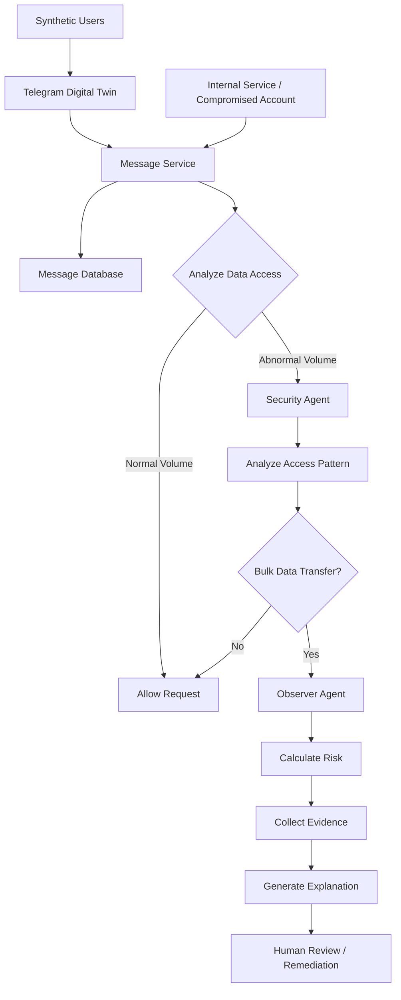
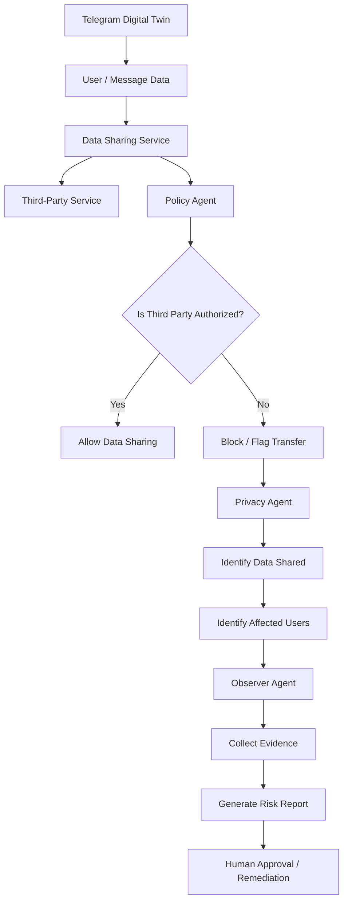
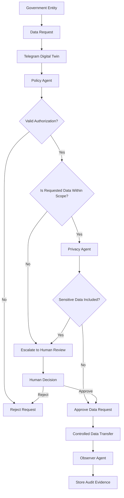
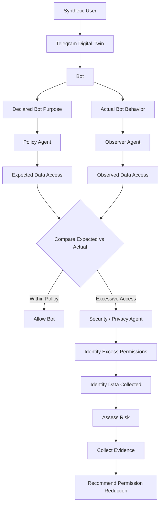
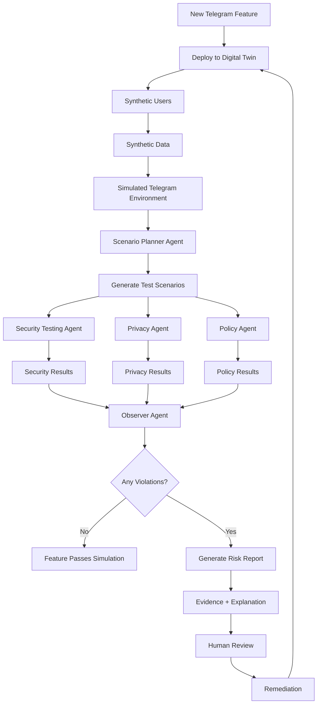
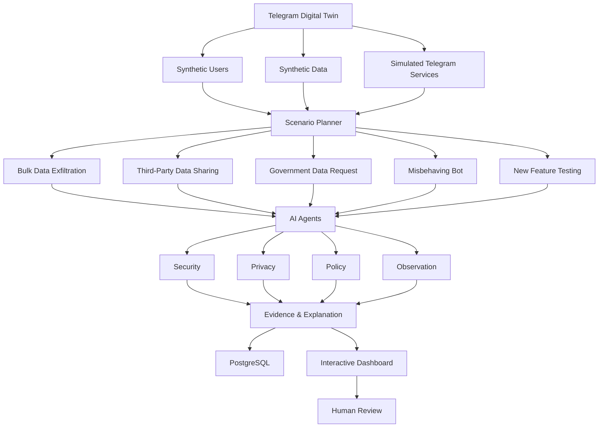

# Telegram Digital Twin — Responsible AI Use Cases

## 1. Bulk User-Data Exfiltration

### Objective

Detect and investigate situations where a compromised account, internal service, or malicious actor attempts to access or transfer unusually large amounts of user data.

### Scenario

A service that normally accesses a small amount of data suddenly requests thousands or millions of messages or user records.



### Example Scenario

```text
Normal behavior:
User → 10 messages

Suspicious behavior:
Internal service → 1,000,000 messages
```

### AI Agent Responsibilities

* Monitor data-access volume.
* Detect abnormal access patterns.
* Identify the actor responsible for the transfer.
* Determine the number of affected users.
* Identify the destination of transferred data.
* Assess the severity of the event.
* Collect supporting evidence.
* Recommend remediation.

### Expected Output

```text
Violation: Bulk User-Data Exfiltration

Actor:
Internal Service

Records Accessed:
1,250,430

Users Affected:
482,000

Severity:
CRITICAL

Recommendation:
Block the transfer and initiate human investigation.
```

---

## 2. Unauthorized Third-Party Data Sharing

### Objective

Detect when user or message data is shared with an external third party without appropriate authorization or policy approval.

### Scenario

A simulated Telegram service sends user information or message data to an external analytics, advertising, or other third-party service.



### Example Scenario

```text
User Data
    ↓
Telegram Digital Twin
    ↓
External Analytics Service
```

Policy:

```text
Message content must not be shared
with unauthorized external parties.
```

### AI Agent Responsibilities

* Identify what data is being shared.
* Identify the recipient.
* Verify whether the recipient is authorized.
* Determine which users are affected.
* Evaluate applicable data-sharing policies.
* Assess privacy risk.
* Store evidence.
* Recommend whether the transfer should be blocked or reviewed.

### Expected Output

```text
Violation: Unauthorized Third-Party Data Sharing

Data Shared:
User Profile + Message Metadata

Recipient:
External Analytics Service

Affected Users:
125,000

Policy:
USER_DATA_THIRD_PARTY_SHARING

Severity:
HIGH

Recommendation:
Block the transfer and require explicit authorization.
```

---

## 3. Government Data Request

### Objective

Simulate and evaluate how a messaging platform responds to requests from a government entity for user information.

### Scenario

A government entity submits a request for user data. The Digital Twin evaluates the request against predefined authorization, privacy, scope, and governance policies.



### Example Scenarios

#### Valid Request

```text
Government Entity
       ↓
Valid Authorization
       ↓
Limited User Data
       ↓
Policy Check
       ↓
Approved
```

#### Overly Broad Request

```text
Government Entity
       ↓
Valid Authorization
       ↓
Request for 10 million users
       ↓
Scope Check
       ↓
Human Review
```

### AI Agent Responsibilities

* Validate the request.
* Determine the requested data scope.
* Identify sensitive information.
* Check applicable policies.
* Determine whether human approval is required.
* Provide an explanation for the decision.
* Record the complete audit trail.

### Expected Output

```text
Request:
Government Data Request #12345

Requested Data:
Messages from 50,000 users

Authorization:
Valid

Scope:
Exceeds permitted scope

Decision:
Human Review Required

Reason:
Requested dataset exceeds the approved purpose.
```

---

## 4. Malicious / Misbehaving Bot

### Objective

Detect when a bot accesses or collects data beyond its declared purpose and permissions.

### Scenario

A bot is registered for group-message moderation but starts accessing user profiles, historical messages, contacts, or other sensitive information.



### Example Scenario

Bot's declared purpose:

```text
Group Message Moderation
```

Expected permissions:

```text
✓ Read group messages
✓ Delete violating messages
```

Actual behavior:

```text
✓ Read group messages
✓ Access user profiles
✓ Access historical messages
✓ Export user information
✓ Access contacts
```

### AI Agent Responsibilities

* Understand the bot's declared purpose.
* Identify expected permissions.
* Monitor actual bot behavior.
* Compare expected and actual data access.
* Detect excessive permissions.
* Identify sensitive data being collected.
* Assess the risk.
* Recommend permission reduction.

### Expected Output

```text
Bot:
Group Moderator Bot

Declared Purpose:
Group Message Moderation

Observed Behavior:
Accessed user profiles and historical messages.

Violation:
Excessive Data Access

Severity:
HIGH

Recommendation:
Remove unnecessary permissions and restrict bot access.
```

---

## 5. New Feature Safety Testing

### Objective

Use the Digital Twin to safely test a new feature before deploying it to a real messaging platform.

### Scenario

A new AI-powered feature is introduced into the simulated Telegram environment.

The feature is tested against synthetic users, synthetic data, security scenarios, privacy policies, and responsible-AI requirements.



### Example Feature

```text
Feature:
AI-powered Message Summarization
```

The Digital Twin can test:

```text
- Can the feature access messages it should not access?
- Does it expose private information?
- Does it send data to an external AI service?
- Does it introduce authorization problems?
- Does it violate data-sharing policies?
- Does it retain data longer than permitted?
- Does it behave correctly under high user load?
```

### AI Agent Responsibilities

**Scenario Planner Agent**

* Generate realistic test scenarios.
* Create different user behaviors.
* Generate normal and malicious scenarios.

**Security Agent**

* Test authentication.
* Test authorization.
* Detect data-access violations.
* Detect abnormal behavior.

**Privacy Agent**

* Monitor sensitive-data access.
* Detect unnecessary data collection.
* Detect unauthorized data sharing.

**Policy Agent**

* Evaluate compliance with predefined policies.
* Determine whether human review is required.

**Observer Agent**

* Monitor the complete simulation.
* Collect events and evidence.
* Maintain the simulation timeline.

### Expected Output

```text
Feature:
AI Message Summarization

Synthetic Users:
1,000

Scenarios:
250

Security Tests:
120

Privacy Tests:
80

Policy Tests:
50

Violations:
3

Result:
FEATURE REQUIRES REMEDIATION

Evidence:
3 policy and privacy violations detected.

Recommendation:
Fix identified issues and re-run the simulation.
```

---

# Summary



:::
